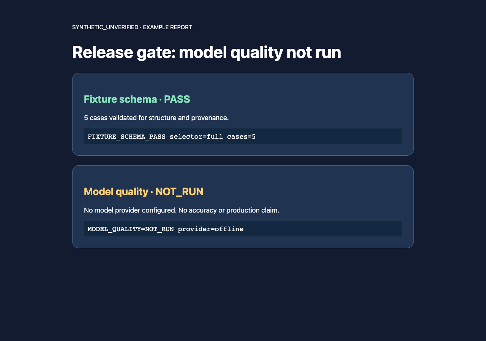
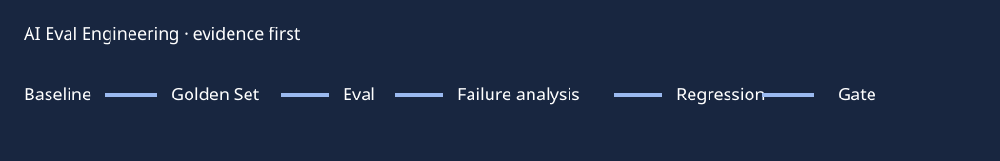

# AI Eval Engineering Starter Kit

**A release-gate starter kit that refuses to confuse fixture validation with model quality.** It helps AI teams preserve baselines, failure cases and evidence boundaries before claiming a feature works.

**LOCAL_RUNNABLE / MODEL_QUALITY=NOT_RUN** · [Example report](docs/example-report.md) · [Case study](docs/case-study.md) · [Resume bullets](docs/resume-bullets.md) · [Interview notes](docs/interview-notes.md)

[](https://github.com/zhouey314-cloud/ai-eval-engineering/actions/workflows/ci.yml)





An offline-first starter kit for evaluating AI features without confusing a
passing test, a model score, or a demo with production evidence.

The operating loop is:

```text
Build → Baseline → Golden Set → Eval → Failure Analysis → Fix → Regression → Release Gate
```

## What is included

- A portable `SKILL.md` for agent workflows.
- Example Golden, Regression and High-Risk JSONL sets.
- A deterministic fixture validator and a small, reproducible runner.
- Rubric and release-gate templates with explicit critical failures.
- Synthetic examples for RAG, agent tool use and customer support.

Every example is marked `synthetic_unverified`. It demonstrates structure; it
is not a verified business standard and must not be presented as customer or
production evidence.

## Quick start

Requirements: Python 3.10+.

```bash
python3 runners/validate_cases.py --smoke
python3 runners/validate_cases.py --full
python3 runners/validate_cases.py --regression
python3 runners/validate_cases.py --high-risk
python3 -m unittest discover -s tests -p 'test_*.py'
```

The runner validates dataset shape and provenance. It does not call a model or
claim that a model would answer correctly. Connect a real provider only in a
private project with credentials, trace capture, and human-approved ground
truth.

Example output from `--full`: `FIXTURE_SCHEMA_PASS selector=full cases=5` and
`MODEL_QUALITY=NOT_RUN provider=offline`. See the [example report](docs/example-report.md)
and [release gate visual](docs/images/release-gate.png).

## Evidence boundary

Traditional tests cover schemas, APIs, persistence, tool arguments and
workflow mechanics. Evals cover correctness, completeness, groundedness,
hallucination, instruction following, business rules and agent trajectory.
Unavailable providers and unreviewed expected answers are `BLOCKED` or
`synthetic_unverified`, never `PASS`.

## Repository map

```text
evals/       datasets and project success contract
rubrics/     observable scoring anchors and release gates
runners/     stable local entry points
examples/    synthetic RAG, agent and support cases
docs/        baseline, regression and failure-analysis guidance
article/     short public explanation of the workflow
```

## Status

This is a reusable offline starter kit. The deterministic fixture checks are
locally verifiable. No provider-backed model quality, latency, cost or
production outcome is claimed by this repository.

## License

MIT. See [LICENSE](LICENSE).

## Failure taxonomy and interview use

Classify failures as Prompt, Retrieval, Knowledge, Parsing, Tool Selection,
Tool Arguments, Tool Failure, Workflow, Hallucination, Instruction Following,
Business Rule, Formatting, Model Capability, Latency, Cost or Unknown. See
[resume bullets](docs/resume-bullets.md) and [interview notes](docs/interview-notes.md).
